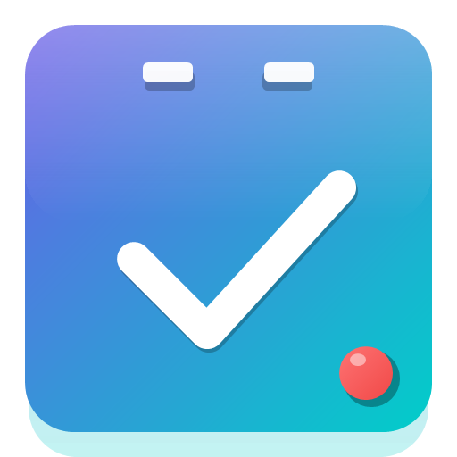
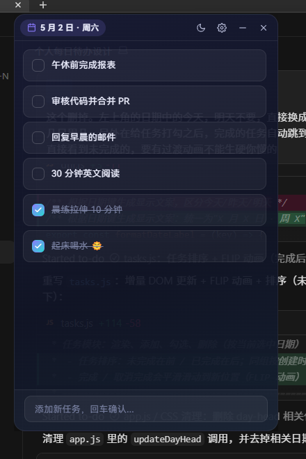

# 每日待办 · 桌面应用

一个轻量、可置顶、模块化的个人每日待办桌面应用（Electron）。

<p align="center">
  
</p>

<p align="center">
  
</p>

## ⬇️ 下载

去 [Releases](https://github.com/shallowcode/daily-todo-app/releases/latest) 页面：

- **每日待办 Setup x.x.x.exe** — NSIS 安装包，自动创建桌面快捷方式 + 开始菜单项 + 卸载程序
- **每日待办-portable-x.x.x.exe** — 便携版，单文件，双击即用，免安装

## ✨ 特性

- **小巧悬浮窗口**（380×600，可调大小，圆角玻璃质感）
- **始终置顶**：让窗口悬浮在浏览器、IDE 等其他应用之上
- **系统托盘**：关闭按钮 = 隐藏到托盘，托盘菜单可随时呼出 / 切置顶 / 切自启
- **开机自启**：可选，登录后自动启动
- **日期切换**：点击顶部日期按钮，弹出月历查看任意日期（过去与未来）
- **自动跨天**：每天午夜后自动切换到当天的待办视图
- **白天/暗色自动切换**：可设置切换时间（默认 06:00 / 19:00），过渡平滑
- **极简任务**：只保留勾选完成 / 删除 / 添加，不分类、不分级
- **本地存储**：数据保存在 `%APPDATA%/daily-todo-app/data.json`
- **模块化**：CSS 与 JS 都按职责拆分到独立文件

## 📁 项目结构

```
daily-todo-app/
├── package.json
├── electron/
│   ├── main.js           # 主进程：窗口/托盘/自启/IPC/数据持久化
│   └── preload.js        # contextBridge 安全暴露 API
├── src/
│   ├── index.html        # 渲染进程页面
│   ├── styles/
│   │   ├── tokens.css    # 主题变量（改色就改这里）
│   │   ├── base.css      # 重置 + 应用外壳 + 过渡
│   │   ├── titlebar.css  # 自定义标题栏
│   │   ├── tasks.css     # 任务列表 / 添加输入
│   │   ├── calendar.css  # 月历弹窗
│   │   └── settings.css  # 设置面板
│   └── modules/
│       ├── util.js       # 工具函数 + 事件总线
│       ├── store.js      # 数据存储（IPC + localStorage 双模式）
│       ├── theme.js      # 主题切换 + 定时
│       ├── tasks.js      # 任务 CRUD
│       ├── calendar.js   # 月历选择器
│       ├── settings.js   # 设置面板
│       └── app.js        # 入口装配
└── assets/               # 应用图标（可选，未提供时用空图标）
```

## 🚀 开发

```bash
npm install
npm start              # 启动应用
npm run dev            # 启动并打开 DevTools
```

## 📦 打包（Windows）

```bash
npm run build          # 同时生成 NSIS 安装包 + 便携版
npm run build:portable # 仅便携版（单文件 exe）
```

产物位于 `dist/`：

- `每日待办 Setup x.x.x.exe` — NSIS 安装程序，会创建桌面快捷方式 + 开始菜单项
- `每日待办-portable-x.x.x.exe` — 便携版，双击即可使用，免安装

## ⚙️ 自定义

- 主题颜色：编辑 `src/styles/tokens.css` 中的 CSS 变量
- 默认窗口大小：编辑 `electron/main.js` 中 `BrowserWindow` 的 `width`/`height`
- 默认主题切换时间：编辑 `electron/main.js` 中 `DEFAULT_DATA.settings`
- 添加新功能：在 `src/modules/` 下新增模块，在 `app.js` 中装配即可

## 📜 数据迁移

数据文件路径：

- Windows：`%APPDATA%\daily-todo-app\data.json`

复制此文件即可在不同设备间迁移。

## 🧩 技术栈

- Electron 31 / Node.js
- 原生 ES Modules（无构建步骤）
- 零运行时依赖
